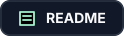

<h1 align="center">
  Addons
</h1>

<p align="center">
  <a href="README.md"></a>
  <a href="#jellyfin-javascript-injector"></a>
  <a href="#planned-addons"></a>
</p>

This page lists every addon in this repository.

## Jellyfin JavaScript Injector

<table>
  <tr>
    <th align="left" width="260">Addon</th>
    <th align="left" width="100">Status</th>
    <th align="left">Description</th>
  </tr>
  <tr>
    <td><a href="ExtraExternalLinks/"><strong>Extra External Links Addon</strong></a></td>
    <td>Ready</td>
    <td>Adds logo-style external-link buttons from provider URLs found in Jellyfin descriptions.</td>
  </tr>
</table>

## Planned Addons

Add future addons here when you create their folders.

```markdown
| New Addon Name | Planned | [Open folder](new-addon-folder/) | Short description of what it does. |
```
