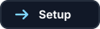

<h1 align="center">
  Jellyfin Addons
</h1>

<p align="center">
  Small Jellyfin web customizations, JavaScript Injector addons, CSS tweaks, and reusable assets.
</p>

<p align="center">
  <a href="ADDONS.md"></a>
  <a href="#using-an-addon"></a>
  <a href="#notes"></a>
</p>

## About

This repository is a home for multiple Jellyfin addons.

Each addon gets its own folder, README, setup steps, source files, styles, and assets. That keeps the repo clean as it grows instead of mixing every script and image together in the root folder.

## Addons

See [ADDONS.md](ADDONS.md) for the full addon list.

<table>
  <tr>
    <th align="left" width="260">Addon</th>
    <th align="left">What It Does</th>
  </tr>
  <tr>
    <td><a href="ExtraExternalLinks/"><strong>Extra External Links Addon</strong></a></td>
    <td>Finds provider URLs in Jellyfin item descriptions, removes the raw URLs, and adds Jellyfin-style external-link buttons with provider logos.</td>
  </tr>
</table>

## Repo Layout

```text
jellyfin-addons
├── README.md
├── ADDONS.md
└── ExtraExternalLinks
    ├── README.md
    ├── injector.js
    ├── src
    ├── styles
    └── assets
```

## Using An Addon

1. Open [ADDONS.md](ADDONS.md).
2. Pick the addon you want.
3. Open that addon's folder.
4. Follow the setup steps in that addon's README.

Most addons are designed so Jellyfin only needs one small script pasted into JavaScript Injector. After that, updates can be made from GitHub.

## Notes

These addons are personal Jellyfin web customizations. They are not official Jellyfin plugins.

For JavaScript Injector addons, browser JavaScript cannot use CSS-style `@import`. If an addon needs multiple files, its folder includes a tiny `injector.js` entry script that loads the needed CSS, config, and JavaScript in a reliable order.
